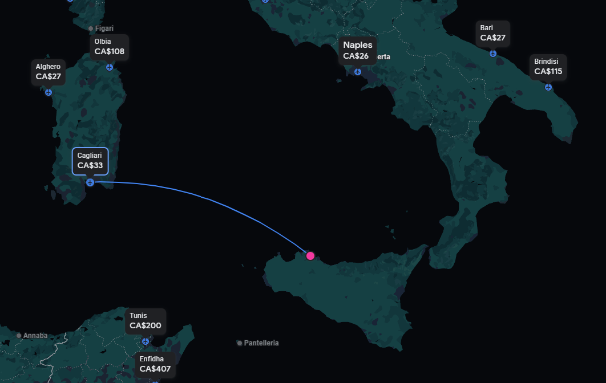
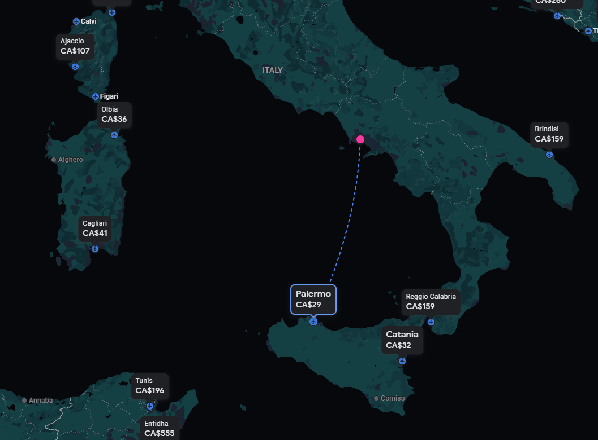

# Italy Plans:

Verily, the Italian Islands doth offer a perfect escapade for gallant comrades seeking adventure. With azure seas and bounteous landscapes, these isles beckon the intrepid souls. In Sicily and Sardinia, ancient ruins whisper tales of bygone eras, whilst in Capri and Ischia, the allure of hedonistic delights doth enthrall. The robust feasts of pasta and vino, served amidst scenic vistas, sate the hearty appetites of brethren. Amidst cobblestone streets and coastal cliffs, the bonds of camaraderie strengthen like tempered steel. 'Tis a realm where history dances with mirth, and the spirit of exploration finds its haven. The Italian Islands, a resplendent tapestry for a fellowship's noble sojourn.

For Native Italianianos

https://github.com/pixlbreaker/ItalianoBrendanoArmagiano/assets/17789967/26a76b1d-074b-4f5d-accc-4a532783dec9

For Non Italianions

https://github.com/pixlbreaker/ItalianoBrendanoArmagiano/assets/17789967/cdb8ba2b-2e46-43d0-9245-3c4883e44d87

## History of Sicily
The history of Sicily has been influenced by numerous ethnic groups. It has seen Sicily controlled by powers, including Phoenician and Carthaginian, Greek, Roman, Vandal and Ostrogoth, Byzantine, Arab, Norman, Aragonese, Spanish, Austrians, British, but also experiencing important periods of independence, as under the indigenous Sicanians, Elymians, Sicels, the greek-siceliotes (in particular Syracuse with its sovereigns), and later as County of Sicily, and Kingdom of Sicily. The Kingdom was founded in 1130 by Roger II, belonging to the Siculo-Norman family of Hauteville. During this period, Sicily was prosperous and politically powerful, becoming one of the wealthiest states in all of Europe.[1] As a result of the dynastic succession, the Kingdom passed into the hands of the Hohenstaufen. At the end of the 13th century, with the War of the Sicilian Vespers between the crowns of Anjou and Aragon, the island passed to the latter. In the following centuries the Kingdom entered into the personal union with the Spaniard and Bourbon crowns, while preserving effective independence until 1816. Sicily was merged with the Kingdom of Italy in 1861. Although today an Autonomous Region, with special statute, of the Republic of Italy, it has its own distinct culture.

Sicily is both the largest region of the modern state of Italy and the largest island in the Mediterranean Sea. Its central location and natural resources ensured that it has been considered a crucial strategic location due in large part to its importance for Mediterranean trade routes.[2] Cicero and al-Idrisi described respectively Syracuse and Palermo as the greatest and most beautiful cities of the Hellenic World and of the Middle Ages.[3][4]

## History of Sardinia
Archaeological evidence of prehistoric human settlement on the island of Sardinia is present in the form of nuraghes and other prehistoric monuments, which dot the land. The recorded history of Sardinia begins with its contacts with the various people who sought to dominate western Mediterranean trade in classical antiquity: Phoenicians, Punics and Romans. Initially under the political and economic alliance with the Phoenician cities, it was partly conquered by Carthage in the late 6th century BC and then entirely by Rome after the First Punic War (230 BC). The island was included for centuries in the Roman province of Sardinia and Corsica, which would be incorporated into the diocese of Italia suburbicaria in 3rd and 7th centuries.

In the Early Middle Ages, through the European barbarian movements, the waning of the Byzantine Empire influence in the western Mediterranean and the Saracen raids, the island fell out of the sphere of influence of any higher government; this led to the birth of four independent kingdoms called Judicates (Latin: Judicati; Sardinian: Judicados) in the 8th through 10th centuries. Falling under papal influence, Sardinia became the focus of the rivalry of Genoa, Pisa, and the Crown of Aragon, which eventually subsumed the island as the Kingdom of Sardinia in 1324. The Iberian Kingdom was to last until 1718, when it was ceded to the House of Savoy; from Piedmont, the Savoyards pursued a policy of expansion to the rest of the Italian peninsula, having their Kingdom of Sardinia be later renamed into "Kingdom of Italy" in 1861.

## Cost Breakdown of the trip
Here we breakdown the most complicated of concepts that 

>"the more money we spend, the less money we have" - Curtis
> -

-Emprical Proof

## Images
These are examples of how we would fly... if Tom Cruise was a commercial pilot

Here is an example of possible flights from Naples

## List of Possible Flights

| Arrival    | Destination | Price | Link
| -------- | ------- | -------- | ------- |
| Toronto  | Palermo | 977 | [Google Flights](https://www.google.com/travel/flights/booking?tfs=CBwQAhprEgoyMDI0LTA1LTEwIh8KA1lZWhIKMjAyNC0wNS0xMBoDRkNPKgJBWjIDNjUxIiAKA0ZDTxIKMjAyNC0wNS0xMRoDUE1PKgJBWjIEMTc3N2oMCAISCC9tLzBoN2g2cgwIAhIIL20vMDlweGNAAUgBcAGCAQsI____________AZgBAg&tfu=CnRDalJJY0UwNExVdE1PRmhwV0UxQlQzaGZXR2RDUnkwdExTMHRMUzB0YjNsamFXMHhNVUZCUVVGQlIxaFNXVGcwUWxCdE1sVkJFZ3hCV2pZMU1YeEJXakUzTnpjYUN3aTJyZ1lRQWhvRFEwRkVPQnh3ejlzRRICCAEiAA&hl=en-US&curr=CAD)
| Toronto  | Naples | 977 | [Google Flights](https://www.google.com/travel/flights/search?tfs=CBwQAhprEgoyMDI0LTA1LTEwIh8KA1lZWhIKMjAyNC0wNS0xMBoDRkNPKgJBWjIDNjUxIiAKA0ZDTxIKMjAyNC0wNS0xMRoDTkFQKgJBWjIEMTI2M2oMCAISCC9tLzBoN2g2cgwIAhIIL20vMGZoc3oaKBIKMjAyNC0wNS0yMGoMCAISCC9tLzBmaHN6cgwIAhIIL20vMGg3aDZAAUgBcAGCAQsI____________AZgBAQ&tfu=CnRDalJJYkRNMVNFdEZVMlV4VTNkQlMyMVlXbmRDUnkwdExTMHRMUzB0TFc5MVltUjJOVUZCUVVGQlIxaFNXa3huU1dwbFdrTkJFZ3hCV2pZMU1YeEJXakV5TmpNYUN3anUrZ1VRQWhvRFEwRkVPQjF3dExVRRICCAEiAA&hl=en-US&curr=CAD)
| Naples | Palermo | 70 | [Google Flights](https://www.google.com/travel/flights/search?tfs=CBwQAhpKEgoyMDI0LTA1LTE0IiAKA05BUBIKMjAyNC0wNS0xNBoDUE1PKgJVMjIENDEwNWoMCAMSCC9tLzBmaHN6cgwIAhIIL20vMDlweGMaKBIKMjAyNC0wNS0xNWoMCAISCC9tLzA5cHhjcgwIAxIIL20vMGZoc3pAAUgBcAGCAQsI____________AZgBAQ&tfu=CmxDalJJTFdGVFNVbEZhRVJSVW1kQlRqVjFXa0ZDUnkwdExTMHRMUzB0YjNsalozVXhPRUZCUVVGQlIxaFNXbGhuUkZCVWQzVkJFZ1pWTWpReE1EVWFDZ2pxTUJBQ0dnTkRRVVE0SEhDWUpBPT0SAggBIgMKATA&hl=en-US&curr=CAD)
| Palermo | Cagliari | 33 | [Google Flights](https://www.google.com/travel/flights/booking?tfs=CBwQAhpKEgoyMDI0LTA1LTE2IiAKA1BNTxIKMjAyNC0wNS0xNhoDQ0FHKgJGUjIEMTAxMGoMCAMSCC9tLzA5cHhjcgwIAhIIL20vMGM3bF9AAUgBcAGCAQsI____________AZgBAg&tfu=CmxDalJJYTNSc1prOUtTbmwwVDFWQlRFTXhWVUZDUnkwdExTMHRMUzB0YjNWaVptb3hOVUZCUVVGQlIxaFNXbTVKVDFwVWNubEJFZ1pHVWpFd01UQWFDZ2l3R1JBQ0dnTkRRVVE0SEhEbkVnPT0SAggBIgMKATA&hl=en-US&curr=CAD)
